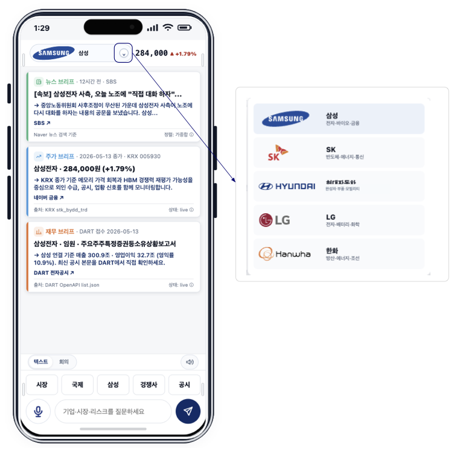

# Korea Corporate Briefing Agent

[](https://github.com/hammerbaki/enterprise-llm-agent-harness/actions/workflows/ci.yml)

Mobile briefing tool for Korea's five largest corporate groups: Samsung, SK,
Hyundai Motor, LG, and Hanwha. The app produces a short, source-linked briefing
per company from public filings (DART), market data (KRX), and news: financial
signals, risks, monitoring points, and follow-up questions. Every visible claim
links back to a registered source.



The same interface produces a source-linked answer for the selected company:


## What's inside

- `src/` - Mobile UI (React + TypeScript + Vite).
- `server/` - Local Node server for source collection and answer assembly.
- `raw/manifests/` - Source manifests, evidence records, and source-backed claims.
- `wiki/` - Maintained context pages used by the answer composer.
- `prompts/` - Short policy prompts at the LLM composition boundary.
- `evals/` - Validation scenarios, evaluation results, fault-injection JSON, and latency dashboards.
- `scripts/` - Ingestion, claim promotion, validation, and release checks.
- `tests/` - Notes and entry points for deterministic behavior checks.
- `configs/`, `public/` - Group/company config and static assets.

The user-facing app is TypeScript. Node automation scripts under `scripts/` and
`server/` are `.mjs`, which is why GitHub's language summary shows JavaScript as
dominant.

## Run it locally

```bash
npm install
npm run dev
```

Live DART, KRX, NAVER, and LLM-provider calls require credentials. Copy
`.env.example` to `.env` and fill in local values. Do not commit `.env`.

## Static demo and CI

`npm run build:demo` produces a credential-free static demo: deterministic
briefing and quick-question snapshots are generated by the local server in
fixture mode and served without any runtime API. See
`docs/deployment-cloudflare.md` for Cloudflare Pages hosting and
`docs/repository-workflow.md` for the single-source-of-truth workflow. CI runs
typecheck, release validation, and the static demo build on every push and
pull request.

## Bundled validations

```bash
npm run validate:release      # structure + template + scenarios
npm run eval:samsung          # Samsung reference-slice scenarios
npm run eval:sk               # SK reference-slice scenarios
npm run eval:hyundai          # Hyundai Motor reference-slice scenarios
npm run eval:lg               # LG reference-slice scenarios
npm run eval:live-llm         # live-LLM composition-boundary checks
npm run eval:fault-injection  # 7-mutation contract sensitivity check
npm run latency:advisor       # latency dashboard from saved measurements
```

Each command writes JSON output under `evals/results/` or `evals/dashboard/`. A
successful `validate:release` exits 0 and prints a summary table for
claim-reference, trace, answer, and hygiene contracts.

The expanded live-LLM protocol is documented in
`docs/live-llm-expanded-evaluation.md`. It supports the full 30-scenario set,
model repeats, temperature settings, and explicit fallback/recovery reporting.

## Design background

The code separates source eligibility, entity routing, claim admission, answer
planning, and trace generation into files rather than into one expanding prompt.
The LLM is responsible for language composition only; everything else lives as
manifests, schemas, and validators.

The deterministic composer used in the bundled validations fills answer sections
from selected source-backed claims without calling a generative model. A live LLM
can be attached at the composition boundary; its output must pass the same answer
contract.

Validation is organized as three families of checks: leakage checks block
internal claim identifiers and raw trace records from reader-facing answers; link
checks require cited sources to resolve to source packages or documented fallback
states; and language checks enforce the insight-first answer structure and block
recommendation-style phrasing.

## Related manuscript

An accompanying manuscript, *Beyond Prompting: Harness Engineering for
Enterprise LLM Agents*, uses this repository's source-to-claim pipeline,
validation scenarios, fault-injection results, and latency measurements. Until a
public preprint is available, cite this repository directly.

If you cite this repository:

```bibtex
@misc{ahn2026harness,
  author = {Ahn, Joongho},
  title  = {enterprise-llm-agent-harness},
  year   = {2026},
  url    = {https://github.com/hammerbaki/enterprise-llm-agent-harness},
  note   = {Accessed 2026-05-23}
}
```

The manuscript cites validation outputs under `evals/results/` and
`evals/dashboard/`, and the review-approved promotion manifest at
`raw/manifests/review-approved-runtime-promotion.json`.

## Versioning

`VERSION` carries the current public artifact label, `CHANGELOG.md` records
release notes, and stable snapshots are tagged. When a revision changes
manifests, scenarios, figures, or validation artifacts, rerun the relevant checks
and record the change in `CHANGELOG.md` before tagging.

## Not investment advice

This is a research and development artifact for technical demonstration. It is
not investment advice, and the named corporate groups are included only as a
public-data slice.
