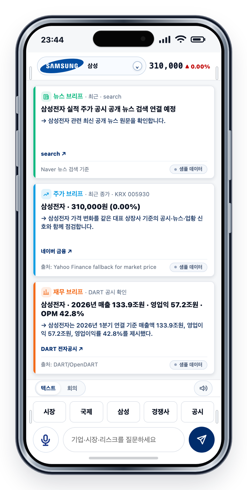
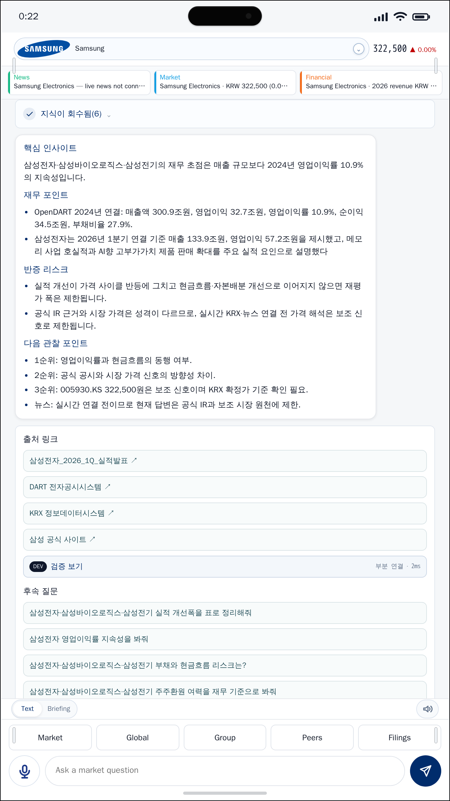

# Korea Corporate Briefing Agent

[](https://github.com/hammerbaki/enterprise-llm-agent-harness/actions/workflows/ci.yml)

## Roadmap / TODO

Listed in **execution order**. The repository has an arXiv (cs.AI) endorsement;
the earlier *Applied Sciences* track is no longer prepared. **Submission is last**
— it happens only after the evaluation/defense and hygiene items below are closed,
so there is no remaining attack surface at submission time.

**1. Phase 3 — external-guardrail baseline (in progress)**
Positions harness engineering against the standard alternative (an external
guardrail layer), beyond the prompt-only ablation. Design + scoring are frozen in
[`docs/phase3-guardrail-baseline-design.md`](docs/phase3-guardrail-baseline-design.md)
and [`docs/phase3-guardrail-scoring-spec.md`](docs/phase3-guardrail-scoring-spec.md).
- [x] Scoring spec frozen (conditions, false-refusal, outcome taxonomy, schema).
- [x] Canonical detector module (`server/detectors.mjs`) + widened to spec scope.
- [x] External-guardrail wrapper mechanics + unit tests (`server/guardrail.mjs`).
- [ ] Guardrail evaluation runner/scorer: 3 conditions (harness / prompt-only /
      external-guardrail) × {reference, adversarial}, to a **dated scratch** result
      (never overwrites a committed baseline — see `docs/live-run-safety.md`).
- [ ] Results table (violations_admitted vs. false_refusals, McNemar) + manuscript
      integration.

**2. Refresh the live-LLM panel** with current models (Claude Opus 4.x / Fable 5)
and more repeats to tighten the Wilson intervals (currently n=90/model).

**3. Reduce the maturity asymmetry** — expand at least one more group beyond
Hanwha to a full reference vertical slice (see Table A1).

**4. Reproducibility & hygiene**
- [ ] One end-to-end reproducible promotion example from a public/synthetic source
      (raw issuer PDFs remain non-redistributed; see `REPRODUCIBILITY.md`).
- [ ] Resolve the remaining `npm audit` low (esbuild, Windows dev server only;
      fix is a breaking major bump). The v0.4.x high/moderate findings were cleared.
- [ ] Capture latency on fixed hardware (or demote latency to a non-headline
      reference), since the budget checks are wall-clock sensitive.

**5. Documentation** — `CONTRIBUTING.md` + a short threat-model note for the
leakage / recommendation-language paths.

**6. Freeze & submit (last — only after 1–5)**
- [ ] Re-pin the manuscript repo (`harness-paper`, `artifacts/dev-pin.txt`) to the
      latest tag and regenerate its tables from this repo.
- [ ] Finalize the arXiv (cs.AI) preprint and submit; add the arXiv ID and link
      here and in `CITATION.cff` once assigned.

Mobile briefing tool for Korea's five largest corporate groups: Samsung, SK,
Hyundai Motor, LG, and Hanwha. The app produces a short, source-linked briefing
per company from public filings (DART), market data (KRX), and news: financial
signals, risks, monitoring points, and follow-up questions. Every visible claim
links back to a registered source.



The same interface produces a source-linked answer for the selected company:



## What's inside

- `src/` - Mobile UI (React + TypeScript + Vite).
- `server/` - Local Node server for source collection and answer assembly.
- `raw/manifests/` - Source manifests, evidence records, and source-backed claims.
- `wiki/` - Maintained context pages used by the answer composer.
- `prompts/` - Short policy prompts at the LLM composition boundary.
- `evals/` - Validation scenarios, evaluation results, fault-injection JSON, and latency dashboards.
- `scripts/` - Ingestion, claim promotion, validation, and release checks.
- `tests/` - Deterministic behavior test suite (`npm test`, `node --test`):
  entity/alias routing, ticker/corp-code mapping, the answer contract, the
  leakage/link/language validation families, and the deterministic composer.
- `configs/`, `public/` - Group/company config and static assets.

The user-facing app is TypeScript. Node automation scripts under `scripts/` and
`server/` are `.mjs`, which is why GitHub's language summary shows JavaScript as
dominant.

## Run it locally

```bash
npm install
npm run dev
```

Live DART, KRX, NAVER, and LLM-provider calls require credentials. Copy
`.env.example` to `.env` and fill in local values. Do not commit `.env`.

## Static demo and CI

`npm run build:demo` produces a credential-free static demo: deterministic
briefing and quick-question snapshots are generated by the local server in
fixture mode and served without any runtime API. See
`docs/deployment-cloudflare.md` for Cloudflare Pages hosting and
`docs/repository-workflow.md` for the single-source-of-truth workflow. CI runs,
on every push and pull request: typecheck, release validation
(`validate:release`), the deterministic test suite (`npm test`), the paper-statistics
no-drift gate (`validate:paper-stats`), and the static demo build.

## Bundled validations

```bash
npm run validate:release      # structure + template + scenarios
npm test                      # deterministic harness invariants (node --test)
npm run validate:paper-stats  # manuscript tables match recomputation (no drift)
npm run eval:samsung          # Samsung reference-slice scenarios
npm run eval:sk               # SK reference-slice scenarios
npm run eval:hyundai          # Hyundai Motor reference-slice scenarios
npm run eval:lg               # LG reference-slice scenarios
npm run eval:live-llm         # live-LLM composition-boundary checks
npm run eval:fault-injection  # 7-mutation contract sensitivity check
npm run latency:advisor       # latency dashboard from saved measurements
```

Each command writes JSON output under `evals/results/` or `evals/dashboard/`. A
successful `validate:release` exits 0 and prints a summary table for
claim-reference, trace, answer, and hygiene contracts.

> **Eval-output safety:** some `eval:*` / `quality:*` commands overwrite committed,
> manuscript-cited artifacts by default. Before using one as a quick check,
> redirect its output to a scratch path (`ADVISOR_EVAL_OUTPUT=…`, etc.). See
> [`docs/live-run-safety.md`](docs/live-run-safety.md).

The expanded live-LLM protocol is documented in
`docs/live-llm-expanded-evaluation.md`. It supports the full 30-scenario set,
model repeats, temperature settings, and explicit fallback/recovery reporting.

## Design background

The code separates source eligibility, entity routing, claim admission, answer
planning, and trace generation into files rather than into one expanding prompt.
The LLM is responsible for language composition only; everything else lives as
manifests, schemas, and validators.

The deterministic composer used in the bundled validations fills answer sections
from selected source-backed claims without calling a generative model. A live LLM
can be attached at the composition boundary; its output must pass the same answer
contract.

Validation is organized as three families of checks: leakage checks block
internal claim identifiers and raw trace records from reader-facing answers; link
checks require cited sources to resolve to source packages or documented fallback
states; and language checks enforce the insight-first answer structure and block
recommendation-style phrasing.

## Related manuscript

An accompanying manuscript, *Beyond Prompting: Harness Engineering for
Enterprise LLM Agents* (targeting arXiv, cs.AI), uses this repository's
source-to-claim pipeline, validation scenarios, fault-injection results, and
latency measurements. Until a public preprint is available, cite this repository
directly.

If you cite this repository:

```bibtex
@misc{ahn2026harness,
  author = {Ahn, Joongho and Kim, Moonsoo},
  title  = {enterprise-llm-agent-harness},
  year   = {2026},
  url    = {https://github.com/hammerbaki/enterprise-llm-agent-harness},
  doi    = {10.5281/zenodo.20685423},
  note   = {Version public-baseline-v0.5.15-pre.1}
}
```

The manuscript cites validation outputs under `evals/results/` and
`evals/dashboard/`, and the review-approved promotion manifest at
`raw/manifests/review-approved-runtime-promotion.json`.

## Versioning

`VERSION` carries the current public artifact label, `CHANGELOG.md` records
release notes, and stable snapshots are tagged. When a revision changes
manifests, scenarios, figures, or validation artifacts, rerun the relevant checks
and record the change in `CHANGELOG.md` before tagging.

## Scope of evaluation

The evaluable object in this work is **harness behavior**, not investment
quality: whether the code-owned contracts — source-grounding, leakage absence,
link resolution, trace completeness, and recommendation-language absence — are
preserved consistently and independently of which language model performs
composition. Investment efficacy is explicitly out of scope. This boundary is
held consistently across the README, the manuscript, and the evaluation
appendix (`docs/paper-evaluation-tables.md`).

## Reproducing the results

`REPRODUCIBILITY.md` maps each reported number to the command that produces it
and the artifact it is read from, and separates the credential-free offline path
from the credential-required live path. The headline statistics tables are
regenerated from committed result artifacts by
`node scripts/compute-paper-stats.mjs` (CI guards against drift via
`npm run validate:paper-stats`), and deterministic harness invariants are pinned
by `npm test` (`node --test`).

## AI-assisted development

Parts of this repository were developed with AI assistance (Claude Code,
Anthropic) — for code, validators, documentation, and figure tooling. All
research design, evaluation, and verification decisions, and all responsibility
for the contents, rest with the human authors listed in
[`CITATION.cff`](CITATION.cff). The AI is a development tool, not an author or a
contributor in the academic sense; some commit messages carry a
`Co-Authored-By` development trailer, which records tool provenance only.

## License

Code (`src/`, `server/`, `scripts/`, `tests/`) is licensed under the MIT License
([`LICENSE`](LICENSE)); data, documentation, and evaluation artifacts are
licensed under CC BY 4.0 ([`LICENSE-DATA`](LICENSE-DATA)). The original issuer
documents behind the promoted claims are **not** redistributed. See
[`LICENSES.md`](LICENSES.md) for the full breakdown, including trademark notes.

## Not investment advice

This is a research and development artifact for technical demonstration. It is
not investment advice, and the named corporate groups are included only as a
public-data slice.
