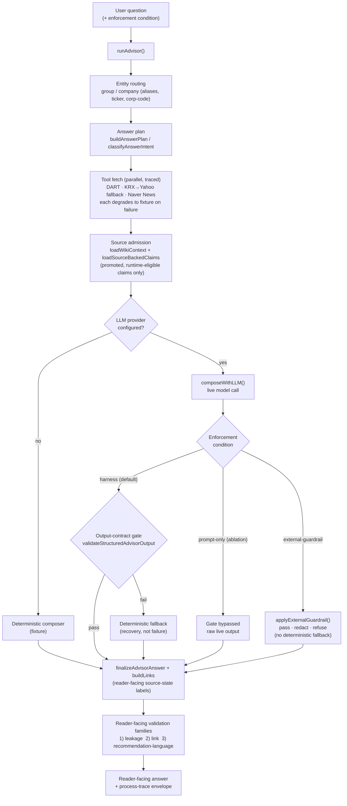

# Runtime harness flow (method figure)

Method figure for the manuscript: how the code-owned harness actually runs an
answer, and where the three enforcement conditions of the Phase 3 guardrail
baseline (Table A5) diverge. Source of truth is `server/index.mjs`
(`runAdvisor` → answer plan → traced tool fetches → source-backed claims →
`composeWithLLM`).

The diagram is **diagram-as-code** ([`architecture-flow.mmd`](architecture-flow.mmd))
so it is reproducible and reviewable; GitHub renders the block below inline.



## Why this figure pairs with Table A5

The `Enforcement condition` branch is exactly the Phase 3 comparison: `harness`
keeps the output-contract gate + deterministic fallback (blocks violations, never
refuses); `prompt-only` bypasses the gate (admits violations); `external-guardrail`
bolts a deterministic policy layer on the output with no fallback (blocks
violations but can refuse / over-redact). The figure makes structurally clear *why*
the harness reached zero violations with full utility while prompt-only admitted
violations and the external guardrail over-blocked.

## Rendering a PNG/PDF for the paper

```bash
npx -y @mermaid-js/mermaid-cli -i docs/architecture-flow.mmd -o docs/architecture-flow.png
# or -o docs/architecture-flow.pdf for a vector figure
```

If a PNG is committed next to this file it was produced by the command above; the
`.mmd` source remains authoritative.
